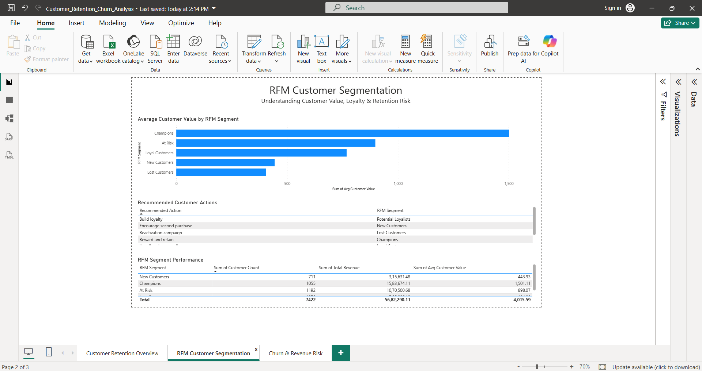

# Customer Retention & Churn Analysis

An end-to-end customer analytics project analyzing **customer retention, RFM segmentation, churn risk, and revenue at risk** for an e-commerce business.

The project follows a complete **SQL → Excel → Power BI** analytics pipeline, transforming raw transaction data into customer-level insights and an interactive three-page Power BI dashboard.

---

## 📌 Project Overview

Customer retention is one of the most important drivers of long-term revenue for an e-commerce business.

This project focuses on understanding:

- How many customers return to make additional purchases
- Which customers are most valuable to the business
- Which customers may be at risk of churn
- How customer behavior changes across cohorts
- Which RFM segments should receive retention-focused actions
- How much revenue is associated with at-risk customers

The analysis combines SQL-based customer analytics, Excel-based validation, and Power BI visualization to create a complete business intelligence workflow.

---

## 🎯 Business Objectives

The project answers the following business questions:

1. What percentage of customers return to make additional purchases?
2. How does customer retention change after the first purchase?
3. Which customer segments generate the most revenue?
4. Which customers are most valuable based on RFM behavior?
5. Which customers are showing signs of churn?
6. How many customers are currently considered at risk?
7. How much revenue is associated with at-risk customers?
8. Which customer segments should the business prioritize for retention campaigns?

---
# 📊 Power BI Dashboard

The final Power BI dashboard consists of three interactive pages covering customer retention, RFM segmentation, and churn/revenue risk.

---

## Page 1 — Customer Retention Overview

This page provides a high-level view of customer retention and customer value.

**Key metrics and visuals:**
- Total Customers
- Repeat Customers
- Repeat Purchase Rate
- At-Risk Customers
- At-Risk Rate
- Revenue at Risk
- Customer Distribution by RFM Segment
- Revenue Contribution by RFM Segment
- Cohort Retention Analysis


---

## Page 2 — RFM Customer Segmentation

This page analyzes customer value using RFM segmentation.

**Key visuals:**
- Average Customer Value by RFM Segment
- Recommended Customer Actions
- RFM Segment Performance
- Customer Count by Segment
- Revenue by Segment



---

## Page 3 — Churn & Revenue Risk

This page focuses on customers who are at risk and the revenue associated with them.

**Key visuals:**
- Active vs At-Risk Customer Distribution
- Revenue at Risk
- Customer Segments by RFM
- Revenue by Customer Segment
- Regional Risk Analysis


---

## 📊 Dataset

The dataset contains e-commerce transaction-level data covering:

- **34,500 orders**
- **7,903 unique customers**
- Data spanning **September 2023 to September 2025**

Each transaction contains information related to:

- Customer ID
- Order date
- Product category
- Price
- Discount
- Region
- Customer demographics
- Order information

The dataset was used to build customer-level metrics and behavioral segments.

---

## 🛠️ Tools & Technologies

| Tool | Purpose |
|---|---|
| **SQL** | Data preparation, customer-level metrics, RFM scoring, cohort analysis and churn identification |
| **Excel** | KPI validation, pivot tables, RFM summaries and retention analysis |
| **Power BI** | Interactive dashboard development and visualization |
| **GitHub** | Project versioning and portfolio documentation |

---

# 🔄 Project Workflow

```text
Raw E-commerce Data
        ↓
      SQL
        ↓
Customer-Level Analysis
        ↓
RFM + Cohort + Churn Analysis
        ↓
      Excel
        ↓
KPI Validation
        ↓
    Power BI
        ↓
Interactive Dashboard
        ↓
Business Insights & Recommendations
